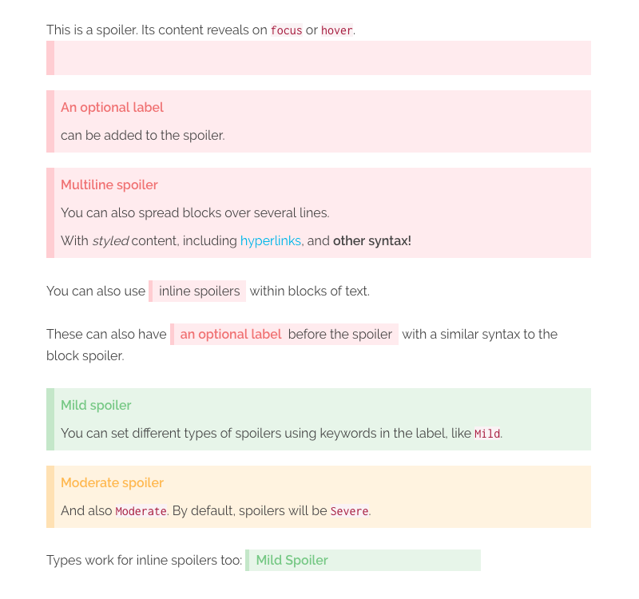

# Markdown Spoilers Plugin

The **Markdown Spoilers** Plugin is for [Grav CMS](http://github.com/getgrav/grav). It extends the Markdown parser to allow the rendering of spoiler elements through simple markdown shortcuts.



## Installation

Installing the Markdown Spoilers plugin can be done in one of two ways. The GPM (Grav Package Manager) installation method enables you to quickly and easily install the plugin with a simple terminal command, while the manual method enables you to do so via a zip file.

### GPM Installation (Preferred)

The simplest way to install this plugin is via the [Grav Package Manager (GPM)](http://learn.getgrav.org/advanced/grav-gpm) through your system's terminal (also called the command line).  From the root of your Grav install type:

    bin/gpm install markdown-spoilers

This will install the Markdown Spoilers plugin into your `/user/plugins` directory within Grav. Its files can be found under `/your/site/grav/user/plugins/markdown-spoilers`.

### Manual Installation

To install this plugin, just download the zip version of this repository and unzip it under `/your/site/grav/user/plugins`. Then, rename the folder to `markdown-spoilers`. You can find these files on [GitHub](https://github.com/thomas-threadgold/grav-plugin-markdown-spoilers) or via [GetGrav.org](http://getgrav.org/downloads/plugins#extras).

You should now have all the plugin files under

    /your/site/grav/user/plugins/markdown-spoilers

> NOTE: This plugin is a modular component for Grav which requires [Grav](http://github.com/getgrav/grav) and the [Error](https://github.com/getgrav/grav-plugin-error) and [Problems](https://github.com/getgrav/grav-plugin-problems) to operate.

## Configuration

Before configuring this plugin, you should copy the `user/plugins/markdown-spoilers/markdown-spoilers.yaml` to `user/config/plugins/markdown-spoilers.yaml` and only edit that copy.

Here is the default configuration and an explanation of available options:

```yaml
enabled: true
include_css: true
```

By default, the plugin includes its own CSS as the hiding/revealing of the text requires it. You can, of course, disable this and write your own custom CSS to suit your site's aesthetic.

## Usage

The plugin allows for both `block` and `inline` spoiler elements.

### Block Spoilers

```markdown
>? This is the spoiler text
```

which will output

```html
<div class="md-spoiler">
    <p class="md-spoiler__line">This is the spoiler text</p>
</div>
```

You can also pass in an optional label, wrapped in `[]`, which will be added as an inline attribute and then rendered as a prefix to the spoiler (via the plugin's CSS):

```markdown
>? [An optional label] This is the spoiler text
```

```html
<div class="md-spoiler" data-label="An optional label">
    <p class="md-spoiler__line">This is the spoiler text</p>
</div>
```

The `block` level spoiler also supports multiple lines within a single spoiler. Labels can only be given to the first line, as it applies to the whole block. However, you can use other inline markdown within the spoiler, such as hyperlinks, italics and bold. Each line will be wrapped in its own `p` tag, and spoiler lines with empty content will be ignored.

```markdown
>? [Label here only] This is the _first_ line
>? The next line will be ignored, as it is empty
>?
>? [Subsequent labels will also be ignored] and output as part of the spoiler
>? but [hyperlinks work](#yay), as does **other syntax!**
```

```html
<div class="md-spoiler" data-label="Label here onlyl">
    <p class="md-spoiler__line">This is the <em>first<em> line</p>
    <p class="md-spoiler__line">The next line will be ignored, as it is empty</p>
    <p class="md-spoiler__line">[Subsequent labels will also be ignored] and output as part of the spoiler</p>
    <p class="md-spoiler__line">But <a href="#yay">hyperlinks work</a>, as does <strong>other syntax!<strong></p>
</div>
```

### Inline Spoilers

Inline spoilers are achieved by wrapping `??` around some text, with **no space** before or after the `??`.

```markdown
You can also use ??inline spoilers?? within blocks of text.

These can also have ??[an optional label] before the juicy spoiler text?? with a similar syntax to the block spoiler.
```

> **NOTE:** For improved readability, there is space allowed between the closing label bracket `]` and the start of your spoiler text.

```html
<p>
    You can also use <span class="md-spoiler md-spoiler--inline"><span class="md-spoiler__line">inline spoilers</span></span> within blocks of text.
</span>

<p>
    Similarly, these can also have <span class="md-spoiler md-spoiler--inline" data-label="an optional label"><span class="md-spoiler__line">before the juicy spoiler text</span></span> with a similar syntax to the block spoiler.
</span>
```

Inline spoilers also support other inline markdown styling within, such as hyperlinks, italics, bold, etc. However, you cannot start an inline style from within the spoiler and end it outside the spoiler, or vice versa. You can wrap an entire spoiler within an inline style though!

```markdown
// These are valid
??a **bold** spoiler??
*an ??italicised?? spoiler*

// These are invalid
*an outside ??italicised* spoiler?? will break
as ??will *one?? like this*
```

### Spoiler Types

The default type of spoiler is considered `Severe`.

There are 2 additional types of spoilers included with the plugin: `Mild`, and `Moderate`. Including either of these keywords as _part of the label_ will change the type of spoiler rendered.

With the plugin's included CSS, `Mild` will render as green and `Moderate` as yellow.

```markdown
>! [Mild] This is a mild spoiler
>! [Mild Spoiler] This will also work

>! [Moderate] This is a moderate spoiler
```

## Extending CSS

You can easily extend the default CSS implementation to provide different types of spoilers. By utilising the attribute selector, you can style the spoiler based on a keyword given as one part of the label.

This is how a `Mild` spoiler is created:

```css
.md-spoiler[data-label~="Mild"] {
    background-color: #e8f5e9;
    border-color: #c8e6c9;
}

.md-spoiler[data-label~="Mild"]::before {
    color: #81c784;
}
```
